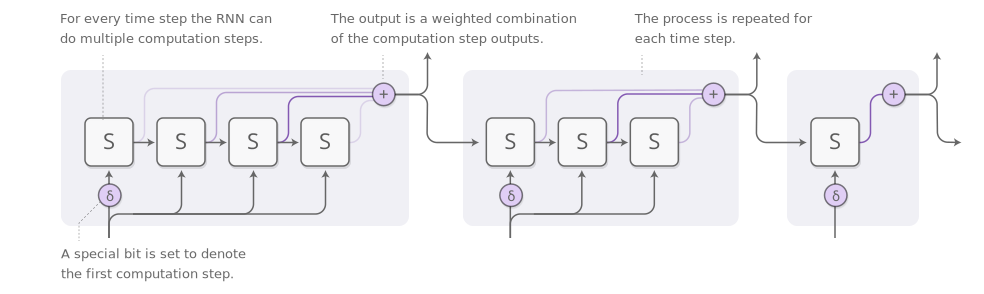

> *augmented* RNNs

* Notes:

    - Notable augmentation of RNNs:
        - Neural Turing Machines. Have external memory that they can read and write to.
        - Attentional Interfaces. Allow RNNs to focus on parts of their input.
        - Adaptive Computation Time. Allows for varying amounts of computation per step.
        - Neural Programmers. Can call functions, building programs as they run.

    - Neural Training Machines. Combine a RNN with an external memory bank, which is an array of vectors.
        
        
        - NTMs, at each step, read and write everywhere, just to differnet extents. For example for 
            reading, instead of single location, the RNN outputs an "attention distribution" that describes 
            how we spread out the amount we care about different memory positions. As such the result 
            of the read operation is a weighted sum. For writing the RNN gives an attention distribution, 
            describing how much we should change each memory position towards the new write value.

        - Read and write capability allows NTMs to perform many simple algorithms, previously beyond neural networks.
            They can mimic a lookup table, learn to srot numbers, with modifications, they can add and multiply numbers, etc.

    - Attentional Interfaces. Neural networks using *attention* focus on part of a subset of the information they're given. 
        For example, an RNN can attend over the output of another RNN. At every time step, it focuses on different positions 
        in the other RNN. This attention, preferably is differentiable, so that we can learn where to focus, for this, we focus 
        everywhere, just to different extents.
        

        - The attention distribution is usually generated with content-based attention. 

        - For translation problem, attention allows the input processing RNN to pass along information about each word it sees, and 
            then for the RNN generating the output to focus on words as they become relevant.

        - This attention between RNNs, in voice recognition, allows one RNN to process the audio and then have another RNN skim over it, 
            focusing on relevant parts as it generates a transcript.

        - In parsing text, it allows the model to glance at words as it generates the parse tree, and for conversational modelling, where 
            it lets the model focus on previous parts of the conversation as it generates its response.

        - Attention can be used as an interface between a convolutional neural network and an RNN. This allows the RNN to look at different 
            position of an image every step, e.g. in image captioning, a conv net processes the image, extracting high-level features. Then an 
            RNN runs, generating a description of the image. As it generates each word in the description, the RNN focuses on the conv net's 
            interpretation of the relevant parts of the image.

    - Adaptive Computation Time. This is a way for RNNs to do different amounts of computation each step, as opposed to standard RNNs which do 
        the same amount of computation for each step. This allows the RNN to do multiple steps of computation for each time step.
        

        - The number of steps should be differentiable. Instead of deciding to run for a descrete number of steps, we have an attention distribution 
            over the number of steps to run. The output is a weighted combination of the outputs of each step.
        
        - Further reading in reference #1.

    - Neural Programmer. It learns to create programs in order to solve a task, and generate a program without needing examples of correct programs. 
        It discovers how to produce programs as a mean to the end of accomplishing some task.
        
        - Further readin in reference #1.

---
* References:

    - [Attention and Augmented Recurrent Neural Networks](https://distill.pub/2016/augmented-rnns/)
